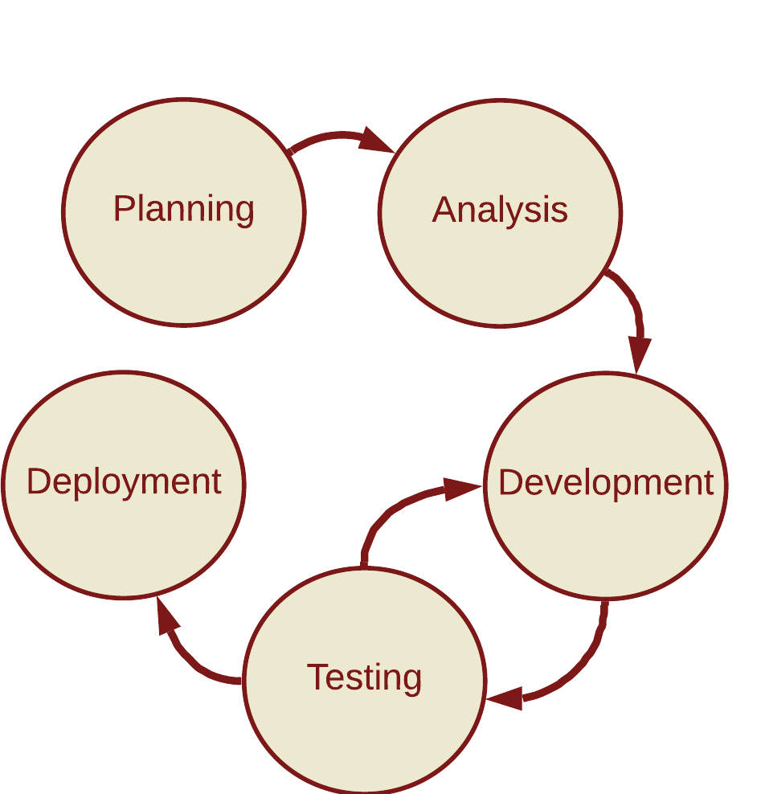

# Team Beige

CS175 Web Development Project: Robert Pope, Jacob Rose, Rian Spangler, and Steven Short

## Retro Game Review: Objective Statement

Team Beige will create a small wiki-like website for retro game consoles featuring hardware, game mechanics, and game/game series reviews. This will be a multi-page project requiring standard content formatting across the website.

## Software Development Life Cycle

### Overview

Employed a Waterfall-like approach transitioning between five phases: planning, analysis, development, testing, and deployment. We cycled between the development and testing phases as necessary to debug any errors and ensure the final product satisfied our final objective.

### Phase 1: Planning

We established our objective statement and outlined the rudimentary requirements for the project: 
  - Develop a Home Page to act as our sites landing page
  - Establish an article layout for our core product (console articles)

### Phase 2: Analysis

We researched similar websites, like Wikipedia and Fandom, and established additional requirements and goals:
  - A method to navigate to articles (Console Pages)
  - A Contact US Page (get to know Team Beige)
  - Administrator Login and Registration Page (Allows Administrators to edit articles. Simulated as site won't involve a proper back-end - beyond scope of course)
  - Color Palette and Font Style (Applied to entire site)
  - General Asset requirements: Logo, Console Page Icons, and simulated Ad space (for flavor)

### Phase 3 and 4: Development and Testing

When a portion of the site was developed, it was subject to testing and review by the group to ensure all requirements and expectations were met. During the testing step, any existing errors were debuged and additional requirements would be sent back to the development phase for implementation.

### Phase 5: Deployment

Deployment for this project was strictly for class purposes. Team Beige conducted a final project review presentation for the CS 175 Final Exam.

## Group Member Responsibilities and Contributions

### Robert Pope

- Generated Home Page HTML File, responsible for general content
- Created full contact us page (CSS and HTML) to link home page and about me pages
- Enforced navigation consistency across website
- Wrote DS family articles
- Contributed individual about me page

### Jacob Rose

 - Designed Home Page CSS, responsible for final layout
 - Contributed to the final color palette
 - Designed Ads for Home Page ad space
 - Wrote Game Boy Advanced articles
 - Contributed individual about me page

### Rian Spangler

 - Designed Console Page Layout (used to link home page to article pages)
 - Contributed to the final font styling
 - Compiled Article HTML and verified content quality
 - Wrote Gameboy articles
 - Contributed individual about me page

### Steven Short

 - Designed general use article css file
 - Designed Administrator Login/Registration Page and simulated functions
 - Designed Logo and Console Page Icons
 - Contributed to the final color palette
 - Wrote Super Nintendo articles
 - Contributed individual about me page
 - Compiled final project in GitHub and enforced style concistancy
